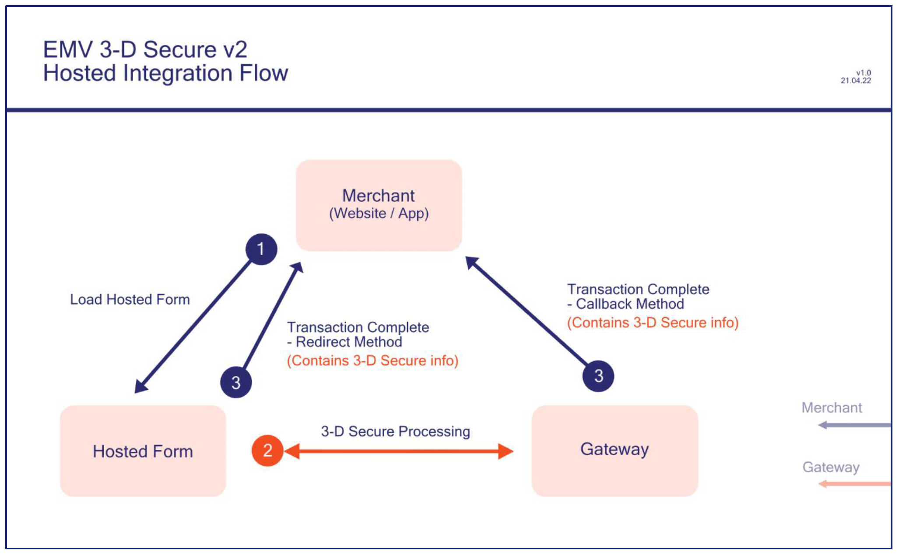

# 3D Secure & Strong Customer Authentication (SCA)

## PSD2 SCA Compliance 

Strong Customer Authentication (SCA) is a requirement of the second Payment Services Directive (PSD2) in the European Economic Area (EEA), Monaco, and the United Kingdom. It aims to add extra layers of security to e-commerce payments by requiring banks to perform additional checks when Customers make payments.

PSD2 is for banks, not for merchants. This means that to comply with the law in their home country, banks must refuse non-compliant payments. To avoid the risk of the bank declining your payment, you as a merchant need to ensure that your payments comply with PSD2 SCA regulations.

You can comply by obtaining additional authentication to verify the Customer’s identity or by providing a valid reason for the payment to be exempt from SCA. Any authentication must use a least two of the following three elements:
1. Something the Customer knows (eg password)
2. Something the Customer has (eg phone)
3. Something the Customer is (eg fingerprint)

PSD2 countries are: Austria, Belgium, Bulgaria, Croatia, Republic of Cyprus, Czech Republic, Denmark, Estonia, Finland, France, Germany, Greece, Hungary, Iceland, Ireland, Italy, Latvia, Liechtenstein, Lithuania, Luxembourg, Malta, Monaco, Netherlands, Norway, Poland, Portugal, Romania, Slovakia, Slovenia, Spain, Sweden, and the UK.

#### Obtaining Strong Customer Authentication 

Strong Customer Authentication applies to Customer entered online transactions (ECOM). Mail Order/Telephone Order (MOTO) transactions and recurring transactions are considered Merchant entered transactions and do not require strong authentication.

Currently, the most common way of authenticating an online card payment is to use 3-D Secure. 3-D Secure is accepted as a means of obtaining Cardholder authentication for the purposes of SCA.

Other card-based payment method such as Apple Pay and some Google Pay payments already support payment flows with a built-in layer of strong authentication (biometric or password). These can be a great way for you to offer a frictionless checkout experience while meeting the new requirements.

We also expect many alternative European payment methods such as PayPal, Amazon Pay, iDEAL, etc. to follow the new SCA rules without any major changes to their user experience.

## 3D Secure Overview 

:::tip
The Gateway supports both 3-D Secure version 1 and version 2 and will use the highest version available. Version 2 is also commonly known as EMV 3-D Secure. 
3DS Version 2 is now enforced across all Europe and it is therefore **MANDATORY** to support it to prevent a high number of declines. 
::: 

3-D Secure authentication is now a **MANDATORY** fraud prevention scheme in Europe that is on all e-commerce card transactions processed by the Gateway, where supported by the Acquirer.

It allows the Cardholder to assign a password to their card that is then verified whenever a transaction is processed through a site that supports the use of the scheme. The addition of password protection allows extra security on transactions that are processed online.

3-D Secure stands for Three Domain Secure. There are 3 parties that are involved in the 3-D Secure process:
- The company from which the purchase is being made.
- The Acquiring Bank (the bank of the company)
- VISA and Mastercard (the card issuers themselves)

The gateway supports EMV 3-D Secure as implemented by Visa, Mastercard and American Express and marketed under the brand names of Visa Secure, Mastercard ID Check and American Express SafeKey. Implementations by JCB (J/Secure) and DCI (ProtectBuy) are not currently supported.

The 3-D Secure preferences can be configured per Merchant Account. These preferences can be overridden per transaction by sending one of the preference fields which hold a comma separated list of the check responses that should be allowed to continue to completion. Responses not in the list will result in the transaction being declined with a `responseCode` of 65803 (3DS_NOT_AUTHENTICATED).

## 3DS Benefits 
- The results are available immediately and returned as part of the transaction.
- The checks can be managed independently allowing you the utmost control over how the results are used.
- The checks can be configured to decline the transaction automatically, where required..
- There are no extra Gateway costs for using 3-D Secure. Your Acquirer may charge to add this onto your business account; however, you may also find that your transaction charges are lower as a result of using 3-D Secure.
- Fully configurable for each merchant account. 

## 3DS Limitations 
- The gateway does not support 3-D Secure for JCB or Diner’s club cards.
- 3-D Secure transactions require a browser in order to display the Customer authentication dialog.

## 3DS Implementation 

If your Merchant Account is set up for 3-D Secure, the Hosted Payment Page will automatically attempt to display the 3-D Secure authentication page for the Customer’s bank. **Good news, there is literally no extra work on your end to support it! 3D secure is fully handled by the gateway.**

The 3-D Secure authentication form is designed and controlled by the Customer’s Issuing bank and will display the Merchant Account name and any website address added when the account was onboarded. You can change the displayed name and website address by sending the `merchantName` and/or `merchantWebsite` request fields. Any `merchantWebsite` must be a fully qualified URL containing at least the scheme and host components.
You may also pass additional information about the transaction and Cardholder, using the `threeDSOptions` field. This extra information can help the Issuer decide on whether a challenge is required.

Your Merchant Account must be configured with your Merchant Category Code (MCC). This value is usually configured in the backend but can also be provided using the `merchantCategoryCode` or `threeDSOptions` request fields.

### Request Flow
 

 - **Step 1: Load the Gateway’s Hosted Form**

 Load the Hosted Form on your web page using your Gateway Integration URL. This must be loaded over HTTPS.

 - **Step 2: The Gateway Processes EMV 3-D Secure v2 Transactions**
 
 Let the Gateway handle the complexities of the 3-D Secure process for you.

 - **Step 3: Transaction Complete**

 Two ways of receiving the final transaction status response are available: via the Redirect URL and the Callback URL. Extra 3-D Secure transaction data is available in this response and can be used by your application for analytical purposes. This holds no sensitive Cardholder information.

 To use 3-D Secure on your Hosted Form, you must enable this support and fully configure your account in the backend (3-D Secure is usually enabled by default for all merchants). There should be no need for you to change your code to enable 3-D Secure support, unless you wish to use the data returned here in step 3.

### Final Response 

These fields are returned when the 3-D Secure stage has completed, and no further challenge is required.
These fields will be returned in addition to the [basic response fields](transactiontypes#transactionResponse).

 | Name      | Mandatory | Description |
| ----------- | ----------- | ----------- |
| threeDSEnabled | Always | Is 3DS enabled for this Merchant Account?     Possible values are:   N – Merchant Account is not enabled.   Y – Merchant Account is enabled.|
| threeDSPolicy | If available | 3DS Policy used. Refer to [SCA using 3-D Secure](#scaUsing3dSecure) for more details.|
| threeDSXID | If 3DS enabled | The unique identifier for the transaction in the 3DS system.|
| threeDSVETimestamp | If 3DS enabled | The time the card was checked for 3DS enrolment, and any initial challenge determined.|
| threeDSEnrolled | If 3DS enabled | The 3DS enrolment status for the credit card. Refer to [3-D Secure Authentication Data](#3dSecureAuthenticationData) for details.     Possible values are:   Y – Enrolled.   N – Not enrolled.   U – Unable to verify if enrolled.   E – Error verifying enrolment.|
| threeDSCATimestamp | If 3DS enabled | The time the last challenge was checked.|
| threeDSAuthenticated | If 3DS enabled | The 3DS authentication status for the credit card. Refer to [3-D Secure Authentication Data](#3dSecureAuthenticationData) for details.     Possible values are:   Y – Authenticated.   A – Attempted to authenticate.   N – Not authenticated.   R – Reject transaction.   I – Information only.   U – Unable to authenticate.   E – Error checking authentication.|
| threeDSECI | If 3DS authenticated | This contains a two-digit Electronic Commerce Indicator (ECI) value. Refer to [3-D Secure Authentication Data](#3dSecureAuthenticationData) for details. The data contained within this property is only valid if the threeDSAuthenticated value is Y or A.|
| threeDSCAVV | If 3DS authenticated |This contains a 28-character Base-64 encoded Cardholder Authentication Verification Value (CAVV). Refer to [3-D Secure Authentication Data](#3dSecureAuthenticationData) for details. The data contained within this property is only valid if the threeDSAuthenticated value is Y or A.|
| threeDSDetails |If 3DS authenticated  |Record containing further details about the 3-D Secure processing stage. Notable sub fields are:  version – 3-D Secure version used   versions – 3-D Secure versions available   psd2Region – whether payment in PSD2 jurisdiction|
| threeDSErrorCode |If 3DS error |Any error response code returned by the ACS if there is an error in determining the card’s 3DS status.|
| threeDSErrorDescription |If 3DS error |Any error response description returned by the ACS if there is an error in determining the card's 3DS status.|
| threeDSResponseCode |Always |A numeric code providing the specific outcome of the 3-D Secure processing stage. Check threeDSResponseMessage for more details of any error that occurred. Refer to [Response Codes](annexes#responseCodes) for more details.|
| threeDSResponseMessage |Always |Any error message relating to the outcome of the 3-D Secure processing stage.|

## Cardholder Information
In the case of a frictionless flow, the card Issuer may sometimes wish to provide a message to the Cardholder. In this case, the `threeDSResponseMessage` will start with the text ‘Cardholder Info: ‘ and be followed by the message from the card Issuer.

## 3DS Options {#3dsOptions}

The following options may be sent in the `threeDSOptions` field to provide additional information to help customise the 3-D Secure experience or to help the ACS decide if a challenge is required.

Some additional information will be automatically provided by the Gateway from standard integration fields unless overridden by providing the associated option. The standard integration field associated with each option is shown in brackets below the options field name. The standard integration field should be used rather than the option, apart from the very rare circumstances where the two must have different values.

:::tip
A few additional information values, such as the Cardholder’s browser details need to be provided. for the Hosted Payment Page integration, the gateway will automatically provide those values. Passing information in the field `threeDSOptions` is fully optional. 
:::

The options must be formatted using the record or serialised record formats detailed in the [format guide](overview#fieldFormats).

| Name      | Mandatory | Description |
| ----------- | ----------- | ----------- |
| browserAcceptHeader (deviceAcceptContent) | Yes | HTTP accept header sent from the Cardholder’s browser.      **For the hosted payment page integration, this value is automatically provided by the gateway.**|
| browserIPAddress (remoteAddress) | Yes | IP v4 address of the Cardholder’s browser.     **For the hosted payment page integration, this value is automatically provided by the gateway.**|
| browserJavaEnabled (deviceCapabilities) | Yes | Ability of the Cardholder’s browser to execute Java.     Possible values are:    true – browser can execute Java    false – browser cannot execute Java     Boolean values must be sent as the strings ‘true’ or ‘false’ unless JSON serialisation is used     **For the hosted payment page integration, this value is automatically provided by the gateway.**|
| browserJavaScriptEnabled (deviceCapabilities) | Yes | Ability of the Cardholder’s browser to execute JavaScript.       Possible values are:    true – browser can execute Javascript    false – browser cannot execute Javascript     Boolean values must be sent as the strings ‘true’ or ‘false’ unless JSON serialisation is used     **For the hosted payment page integration, this value is automatically provided by the gateway.**|
| browserLanguage (deviceAcceptLanguage) | Yes | The Cardholder’s browser language. The browser language as defined in IETF BCP 47.     **For the hosted payment page integration, this value is automatically provided by the gateway.**|
| browserScreenColourDepth or browserScreenColorDepth (deviceScreenResolution) | Yes | The screen colour depth of the Cardholder’s browser. A value representing the bit depth of the colour palette, in bits per pixel, for displaying images.     Possible values are: 1, 4, 8, 15, 16, 24, 32, 48.      This value is not mandatory if the browser doesn’t support JavaScript.     **For the hosted payment page integration, this value is automatically provided by the gateway.**|
| browserScreenHeight (deviceScreenResolution) | Yes | The screen height of the Cardholder’s browser.     This value is not mandatory if the browser doesn’t support JavaScript.     **For the hosted payment page integration, this value is automatically provided by the gateway.**|
| browserScreenWidth (deviceScreenResolution) | Yes | The screen width of the Cardholder’s browser.     This value is not mandatory if the browser doesn’t support JavaScript.     **For the hosted payment page integration, this value is automatically provided by the gateway.**|
| browserTimeZone (deviceTimeZone) | Yes | The difference between UTC time and the cardholder's browser local time in minutes.     **For the hosted payment page integration, this value is automatically provided by the gateway.**|
| browserUserAgent (deviceIdentity) | Yes | The User-Agent header provided by the Cardholder’s browser.     **For the hosted payment page integration, this value is automatically provided by the gateway.**|
| challengeWindowSize | No | The dimensions of the challenge window that has been displayed to the cardholder. The ACS shall reply with content that is formatted to appropriately render in this window to provide the best possible user experience.     Possible values are:   01 – 250 x 400   02 – 390 x 400 (default)   03 – 500 x 600   04 – 600 x 400   05 – Full screen|
| transactionType | No |Identifies the type of transaction being authenticated. This field is required in some markets (eg for Merchants in Brazil).      Possible values are:    01 – Goods/ Service Purchase    03 – Check Acceptance    10 – Account Funding    11 – Quasi-Cash Transaction    28 – Prepaid Activation and Load|
| cardholderEmail (customerEmail) | No | The Cardholder’s email address.|
| cardholderHomePhone (customerPhone) | No | The Cardholder’s home phone number specified in the following format: “+CountryCode Subscriber” (eg “+44 1234567899”).|
| cardholderMobilePhone (customerMobile)| No | The Cardholder’s mobile phone number specified in the following format: “+CountryCode Subscriber” (eg “+44 1234567899”).|
| cardholderName (customerName)| No | Name of the Cardholder. Limited to the alphanumeric characters listed in EMV Book 4, Annex B.|
| cardholderWorkPhone | No |The Cardholder’s work phone number specified in the following format: “+CountryCode Subscriber” (eg “+44 1234567899”).|
| deliveryTimeframe | No |Merchandise Delivery Timeframe.     Possible values are:   01 – Electronic Delivery   02 – Same day shipping   03 – Overnight shipping   04 – Two-day or more shipping|
| giftCardAmount | No |For prepaid or gift card purchase, the purchase amount total of prepaid or gift card(s) in major units (for example, USD 123.45 is 123).|
| giftCardCount | No |For prepaid or gift card purchase, total count of individual prepaid or gift cards/codes purchased.|
| giftCardCurrencyCode | No |For prepaid or gift card purchase, the currency code of the card as an ISO 4217 3-digit code or its 3 letter equivalent.|
| instalmentPaymentData or installmentPaymentData | No |Indicates maximum number of authorizations permitted for instalment payments. Value must be greater than 1.|
| merchantCategoryCode (merchantCategoryCode) | No |Code describing the Merchant's type of business, product, or service.|
| merchantCountryCode (countryCode) | No |Country code of the merchant as an ISO 3166-1 3-digit code or its 2 or 3 letter equivalents.|
| merchantFraudRate | No |Merchant’s fraud rate in the EEA (all EEA card fraud divided by all EEA card volumes) calculated as per PSD2 RTS. This value is sent to Mastercard only who will not calculate or validate the fraud score.     Value will be a numeric value, between 1 and 99, representing the fraud rate, such as:   1 – less than or equal to 1 basis point (bp), which is 0.01%   2 – between 1 bp + - and 6 bps   3 – between 6 bps + - and 13 bps   4 – between 13 bps + - and 25 bps   5 – greater than 25 bps|
| merchantName (merchantName) | No |Merchant name.|
| paymentAccountAge | No |Date that the payment account was enrolled in the cardholder's account with the 3DS Requestor. Accepted date format is YYYYMMDD.|
| paymentAccountAgeIndicator | No |Indicates the length of time that the payment account was enrolled in the cardholder's account with the 3DS Requestor.   Possible values are:   01 – No account (guest check-out)   02 – Created during this transaction   03 – Less than 30 days   04 – 30-60 days   05 – More than 60 days|
| preOrderDate | No |For a pre-ordered purchase, the expected date that the merchandise will be available. Accepted date format is YYYYMMDD.|
| preOrderPurchaseIndicator | No |Indicates whether Cardholder is placing an order for merchandise with a future availability or release date.     Possible values are:   01 – Merchandise available   02 – Future availability|
| priorAuthData | No |Data that documents and supports a specific authentication process.|
| priorAuthMethod | No |Mechanism used by the Cardholder to previously authenticate to the 3DS Requestor.     Part of the optional 3DS Requestor Prior Transaction Authentication Information that contains information about a 3DS cardholder authentication that occurred prior to the current transaction.     Possible values are:   01 – Frictionless authentication occurred by ACS   02 – Cardholder challenge occurred by ACS   03 – ACS verified   04 – Other issuer methods|
| priorAuthTimestamp | No |Date and time in UTC of the prior cardholder authentication. Accepted date format is YYYYMMDDHHMM.|
| priorReference | No |Provides additional information to the ACS to determine the best approach for handling a request. It contains an ACS Transaction ID for a prior authenticated transaction (for example, the first recurring transaction that was authenticated with the cardholder).|
| recurringExpDate | No |This field contains the date after which no further authorizations shall be performed. The format of this field must be: YYYYMMDD.|
| recurringFrequency | No |This field indicates the minimum number of days between authorizations.|
| reorderItemsIndicator | No |Indicates whether the cardholder is reordering previously purchased merchandise.     Possible values are:   01 – First time ordered   02 – Reordered|
| reqAuthData | No |Data that documents and supports a specific authentication process. In the current version of the specification, this data element is not defined in detail, however the intention is that for each 3DS Requestor Authentication Method, this field carry data that the ACS can use to verify the authentication process.|
| reqAuthMethod | No |Method used by the Cardholder to authenticate to the 3DS Requestor.     Part of the 3DS Requestor Authentication Information which contains optional information about how the cardholder authenticated during login to their 3DS Requestor account.     Possible values are:   01 – No 3DS Requestor authentication occurred (ie cardholder "logged in" as guest)   02 – Login to the cardholder account at the 3DS Requestor system using 3DS Requestor's own credentials   03 – Login to the cardholder account at the 3DS Requestor system using federated ID   04 – Login to the cardholder account at the 3DS Requestor system using issuer credentials   05 – Login to the cardholder account at the 3DS Requestor system using third-party authentication   06 – Login to the cardholder account at the 3DS Requestor system using FIDO Authenticator|
| reqAuthTimestamp | No |Date and time in UTC of the cardholder authentication. Accepted date format is YYYYMMDDHHMM.|
| requestorChallengeIndicator | No |Indicates whether a challenge is requested for this transaction. For example: you may be using this to obtain SCA and not want to be challenged as you have provided an exemption. This also allows you to request a challenge when adding a card to a wallet or to follow mandates.     Possible values are:   01 – No preference   02 – No challenge requested   03 – Challenge requested: 3DS Requestor Preference   04 – Challenge requested: Mandate   05 – No challenge requested (TRA is already performed)   06 – No challenge requested (data share only)   07 – No challenge requested (SCA is already performed)   08 – No challenge requested (utilize whitelist exemption)   09 – Challenge requested (whitelist prompt requested)     Values 05 to 09 are for protocol version 2.2.0 but will be accepted for 2.1.0 and 05 to 08 will be downgraded to 02, and 09 to 01. Values 05 to 07 will be passed to Mastercard as part of their 'Merchant Data' extension. Values 08 and 09 are only valid for protocol version 2.2.0.|
| requestorID | No |Directory server assigned 3DS Requestor identifier. (Default on file)|
| requestorName | No |Directory server assigned 3DS Requestor name. (Default on file)|
| requestorURL (merchantWebsite) | No |3DS Requestor website or customer care site.|
| accountAgeIndicator | No | Length of time that the cardholder has had the account with the 3DS Requestor.      Possible values are:    01 – No account (guest check-out)    02 – Created during this transaction    03 – Less than 30 days    04 – 30-60 days    05 – More than 60 days|
| accountChangeDate | No | Date that the cardholder's account with the 3DS Requestor was last changed. Accepted date format is YYYYMMDD.|
| accountChangeIndicator | No | Length of time since the cardholder's account information with the 3DS Requestor was last changed.      Possible values are:    01 – Changed during this transaction.    02 – Less than 30 days    03 – 30-60 days    04 – More than 60 day|
| accountDate | No | Date that the cardholder opened the account with the 3DS Requestor. Accepted date format is YYYYMMDD.|
| accountDayTransactions | No | Number of transactions (successful and abandoned) for this cardholder account with the 3DS Requestor across all payment accounts in the previous 24 hours.|
| accountId | No | Identifier for any Cardholder’s account with the Merchant.|
| accountPasswordChangeDate | No | Date that cardholder's account with the 3DS Requestor had a password change or account reset. Accepted date format is YYYYMMDD.|
| accountPasswordChangeIndicator | No | Indicates the length of time since the cardholder's account with the 3DS Requestor had a password change or account reset.      Possible values are:   01 – No change   02 – Changed during this transaction   03 – Less than 30 days   04 – 30-60 days   05 – More than 60 days|
| accountProvisioningAttempts | No | Number of account provisioning attempts in the last 24 hours.|
| accountPurchaseCount | No | Number of purchases with this cardholder account during the previous six months.|
| accountType | No | Indicates the type of account.     Possible values are:   01 – Not applicable   02 – Credit   03 – Debit|
| accountYearTransactions | No | Number of transactions (successful and abandoned) for this cardholder account with the 3DS Requestor across all payment accounts in the previous year.|
| accountYearTransactions | No | Number of transactions (successful and abandoned) for this cardholder account with the 3DS Requestor across all payment accounts in the previous year.|
| acquirerBIN | No | Acquirer bank identification number. (Default on file)|
| acquirerCountryCode | No | Acquirer country code when the Acquirer country differs from the Merchant country and the Acquirer is in the EEA (this could mean that the transaction is covered by PSD2). (Default on file)|
| acquirerMerchantID | No | Acquirer-assigned merchant identifier. (Default on file)|
| acsChallengeMandatedIndicator | No |Indication of whether a challenge is required for the transaction to be authorized due to local/regional mandates or other variables.|
| addressMatch | No |Indicates to the ACS whether the cardholder shipping address and billing address are the same.      Possible values are:   Y – Shipping address matches billing address.   N – Shipping address does not match billing address.|
| authenticationIndicator | No |Provides additional information to the ACS to determine the best approach for handing an authentication request.     Possible values are:    01 – Payment - default    02 – Recurring    03 – Instalment    04 – Add Card    05 – Maintain Card    06 – Verify Cardholder    07 – Billing Agreement|
| billingAddressCity (customerTown) | No |The city of the address. Maximum length is 50 characters.|
| billingAddressCountryCode (customerCountryCode) | No |The country of the address as an ISO 3166-1 3-digit code or its 2 or 3 letter equivalents.|
| billingAddressLine1 (customerAddress) | No |The first line of the street address or equivalent local portion of the address. Maximum length is 50 characters.|
| billingAddressLine2 | No |The seconf line of the street address or equivalent local portion of the address. Maximum length is 50 characters.|
| billingAddressLine3 | No |The third line of the street address or equivalent local portion of the address. Maximum length is 50 characters.|
| billingAddressPostcode (customerPostcode) | No |The ZIP or other postal code of the address. Maximum length is 16 characters.|
| billingAddressState | No |The state or province of the address as an ISO 3166-2 country subdivision code. Maximum length is 3 characters.|
| secureCorporatePaymentIndicator | No |Indicates dedicated payment processes and procedures were used, potential secure corporate payment exemption applies.|
| serverOperatorID | No |3DS Server identifier. (Default on file)|
| serverRefNumber | No |Assigned server reference number. (Default on file)|
| shipAddressUsageDate | No |Date when the shipping address used for this transaction was first used with the 3DS Requestor. Accepted date format is YYYYMMDD.|
| shipAddressUsageIndicator | No |DIndicates the length of time since the shipping address used for this transaction was first used with the 3DS Requestor.     Possible values are:   01 – This transaction   02 – Less than 30 days   03 – 30-60 days   04 – More than 60 days|
| shipIndicator | No |Indicates shipping method chosen for the transaction. Merchants must choose the Shipping Indicator code that most accurately describes the cardholder's specific transaction, not their general business. If one or more items are included in the sale, the Shipping Indicator code for the physical goods is used, or if all digital goods, the Shipping Indicator code that describes the most expensive item.     Possible values are:   01 – Ship to cardholder's billing address   02 – Ship to another verified address on file with merchant   03 – Ship to address that is different than the cardholder's billing address   04 – "Ship to Store" / Pick-up at local store (Store address shall be populated in shipping address fields)   05 – Digital goods (includes online services, electronic gift cards and redemption codes)   06 – Travel and Event tickets, not shipped   07 – Other (for example, Gaming, digital services not shipped, emedia subscriptions, etc.)|
| shipNameIndicator | No |Indicates if the Cardholder Name on the account is identical to the shipping Name used for this transaction.     Possible values are:   01 – Account Name identical to shipping Name   02 – Account Name different than shipping Name|
| shippingAddressCity (deliveryTown) | No |The city of the address. The maximum length is 50 characters.|
| shippingAddressCountryCode (deliveryCountryCode) | No |The country of the address as an ISO 3166-1 3-digit code or its 2 or 3 letter equivalents.|
| shippingAddressLine1 (deliveryAddress) | No |The first line of the street address or equivalent local portion of the address. Maximum length is 50 characters.|
| shippingAddressLine2 | No |The second line of the street address or equivalent local portion of the address. Maximum length is 50 characters.|
| shippingAddressLine3 | No |The third line of the street address or equivalent local portion of the address. Maximum length is 50 characters.|
| shippingAddressPostcode (deliveryPostcode) | No |The ZIP or other postal code of the address. Maximum length is 16 characters.|
| shippingAddressState | No |The state or province of the address as an ISO 3166-2 country subdivision code. Maximum length is 3 characters.|
| suspiciousAccountActivity | No |Indicates whether the 3DS Requestor has experienced suspicious activity (including previous fraud) on the cardholder account.       Possible values are:    01 – No suspicious activity has been observed    02 – Suspicious activity has been observed|
| whitelistStatus | No |Whitelist status.     Possible values are:   Y – 3DS Requestor is whitelisted by cardholder   N – 3DS Requestor is not whitelisted by cardholder|

## 3-D Secure Authentication Data {#3dSecureAuthenticationData}

The 3-D Secure system uses various data fields to report the authentication status of the Cardholder. Each 3-D Secure version may use slightly different terminology for the fields and have slightly different values but for ease of use the Gateway uses the terminology and values as described in this appendix.

The field’s values would normally be populated by the Gateway’s 3DS Server component (The 3DS Server is the Gateway/Merchant component that provides the interface with the 3DS Directory Server), however you may choose to use your own 3DS Server component and provide the values.

### 3D Secure enrolment status

The `threeDSEnrolled` field indicates if the card is enrolled in the 3-D Secure program.

The value is determined if the card number is within one of the enrolled ranges downloaded daily from the Directory Server using a Preparation Request/Response (PReq/PRes) message.

The field can contain one of the following values:

**Y – Enrolled**. The card is enrolled in the 3-D Secure program and the payer is eligible for authentication
processing.

**N - Not Enrolled**. The checked card is eligible for the 3-D Secure (it is within the card association’s range of accepted cards) but the card issuing bank does not participate in the 3-D Secure program. If the Cardholder later disputes the purchase, the issuer may not submit a chargeback to you.

**U - Unable To Verify Enrolment**. The card associations were unable to verify whether the Cardholder is registered. As the card is ineligible for 3-D Secure, you can choose to accept the card nonetheless and precede the purchase as non-authenticated and submits authorisation with ECI 07.

**E - Error Verifying Enrolment**. The Gateway encountered an error. This card is flagged as 3-D Secure ineligible. The card can be accepted for payment at your discretion.

### 3DS Authentication status

The `threeDSAuthenticated` field indicates if the cardholder has been authenticated by the 3-D Secure program.

The value is provided by the Directory Server either on requesting authentication in the Authentication Response (ARes) message, in the case of a frictionless flow, or after a Cardholder
challenge in the Result Request (RReq) message, in the case of a challenge flow.

The field can contain one of the following values:

**Y - Authentication Successful**. The Issuer has authenticated the Cardholder by verifying the identity information or password. A CAVV and an ECI of 5 is returned. The card is accepted for payment and authentication data passed to authorisation processing.

**A - Attempted Authentication**. A proof of authentication attempt was generated. The Cardholder is not participating, but the attempt to authenticate was recorded. The card can be accepted for payment at your discretion and authentication data passed to authorisation processing.

**N - Not Authenticated**. The Cardholder did not complete authentication and the card should not be accepted for payment.

**R – Rejected By Issuer**. The Issuer rejected the transaction and must not be accepted for payment.

**D – Decoupled Challenge Required**. Decoupled authentication confirmed.

**I – Information Only**. 3DS Requestor challenge preference acknowledged.

**U - Unable To Authenticate**. The authentication was not completed due to technical or another problem. A transmission error prevented authentication from completing. The card can be accepted for payment at your discretion, but no authentication data will be passed on to authorisation processing.

**E - Error Checking Authentication**. The Gateway encountered an error. The card can be accepted for payment at your discretion, but no authentication data will be passed on to authorisation processing.

### 3DS Transaction Identifier 

The `threeDSXID` field provides a unique value to identify the transaction through the 3-D Secure system.
The value is provided by the Directory Server and is a 36-character universally unique identifier (UUID) as defined in IETF RFC 4122.

### 3DS Electronic Commerce Indicator

The `threeDSECI` field indicates the security status of the transaction after the Cardholder has been authenticated or attempted authentication.

The value is provided by the Directory Server either on requesting authentication in the Authentication Response (ARes) message, in the case of a frictionless flow, or after a Cardholder challenge in the Result Request (RReq) message, in the case of a challenge flow.

The value is always present if the `threeDSAuthenticated` field has a value of Y (successful authentication), or A (attempted authentication) but can be present at other times.

The field can contain one of the following 2-digit values (the values are shown as pairs, the first value is for Visa and other Card Schemes and the second for Mastercard only):

- **05/02** - Both cardholder and card issuing bank are 3DS enabled. 3DS card authentication is successful.
- **06/01** - Either cardholder or card issuing bank is not 3DS enrolled. 3DS card authentication is unsuccessful, in sample situations as:
    - 3DS cardholder not enrolled.
    - Card issuing bank is not 3DS ready.
- **07/00** - Authentication is unsuccessful or not attempted. The card is either a non-3DS card or card issuing bank does not handle it as a 3DS transaction.

### 3DS Cardholder Authentication Verification Value

The `threeDSCAVV` field provides proof that the Cardholder has been authenticated or attempted authentication.

The value is provided by the Directory Server either on requesting authentication in the Authentication Response (ARes) message, in the case of a frictionless flow, or after a Cardholder challenge in the Result Request (RReq) message, in the case of a challenge flow.

The value is present if the `threeDSAuthenticated` field has a value of Y (successful authentication), or A (attempted authentication).

The field will contain a 28-character Base-64 encoded value (32-characters for Mastercard).

## SCA Using 3-D Secure {#scaUsing3dSecure}

:::tip
Note that the below mentioned policies are set automatically on each merchant account and there is no need of extra development unless you want to use SCA exemptions.
:::

3-D Secure can be used to provide the necessary Strong Customer Authentication. You have a choice of how and when to use 3-D Secure to satisfy SCA:

**Authentication Before Authorisation**
You submit payments using 3-D Secure for authentication up front so that the authorisation will be submitted to the Acquirer with the appropriate authentication data showing that SCA was sought. You may pass an exemption indicator (an exemption can be explicitly requested using the `scaExemption` field) causing the Gateway to automatically request a frictionless flow (the Gateway will use the correct ‘requestorChallengeIndicator’ unless overridden by any value passed in the request).

**Authentication After Authorisation, when requested by the Issuer (Bypass)**
You submit payments without 3-D Secure authentication but with an exemption indicator (an exemption can be explicitly requested using the `scaExemption` field), if required, and the authorisation will be submitted to the Acquirer with no authentication data. If the Issuer approves the authorisation, then no further additional authentication is needed. However, if the Issuer refuses the authorisation due to SCA being required (the issuer will soft decline the transaction indicating SCA is required) then transaction can be repeated but this time using 3-D Secure (you are advised to send a `threeDSOptions` ‘requestorChallengeIndicator’ value of 4 to mandate a challenge) and no exception indicator.

The Gateway can support both choices and in the case of the second choice it can automatically perform the repeat transaction on your behalf.

The choice of how and when authentication is performed is indicated by selecting a 3-D Secure Policy in the Merchant Management System or by sending the `threeDSPolicy` field in the request.

The policies available are:
1. Authenticate Before Authorisation or When Issuer Requests (Default)
2. Authenticate Before Authorisation Only
3. Authenticate When Issuer Requests Only (Bypass)
4. Authenticate Before Authorisation or When Issuer Requests [PSD2]
5. Authenticate Before Authorisation Only [PSD2]
6. Authenticate When Issuer Requests Only [PSD2] (Bypass)

The [PSD2] policies will perform 3-D Secure authentication only if the transaction falls within the jurisdiction of the European Union's Payment Services Directive 2, otherwise it will behave as if 3-D Secure had not been required.

### SCA Soft-Declines

There are two main types of card transaction declines: hard declines and soft declines.

Hard declines happen when the issuing bank rejects the transaction. Examples include attempting to use a card that has been reported lost or stolen, or the card has expired. Hard declines are permanent, so the payment should not be retried.

Soft declines are temporary authorisation failures. Around 80% to 90% of all declines fall into this category. They occur for a host of reasons including the need to authenticate the Cardholder further or because there are issues with the technical infrastructures that process the transaction. Soft declines are temporary, meaning you can process the transaction again after meeting the requirements that led to the decline the first time around.

If you do not obtain SCA on an eligible payment the issuer may soft decline the payment insisting that SCA be obtained. In which case a `responseCode` of 65 will be returned by the Gateway and you can choose to resubmit the payment with SCA if required.

With the Handpoint Gateway you can use 3-D Secure to obtain SCA and automatically retry payments that have been soft declined for this reason. If 3-D Secure has been used to provide SCA and the issuer still declines insisting that SCA be obtained, then the Gateway will return a normal decline `responseCode` of 5 to prevent an infinite loop of obtaining SCA and then being declined for lack of SCA.

### Exemptions to Strong Customer Authentication {#scaExemptions}

There are some e-commerce transactions which are out of scope of the regulation, and others that may be exempt.

Obtaining Strong Customer Authentication can add friction and increase Customer drop-off and therefore you should make use of exemptions to reduce the number of times you will need to authenticate a Customer.

However, the bank has the right to refuse any requested exemption and decline the payment insisting that SCA be obtained. The following exemptions are available:

#### Mail Order / Telephone Order Payments

Card details collected via mail or over the phone (MOTO) fall outside of the scope of SCA and do not require authentication. You can flag such payments by passing a value of ‘2’ in the `type` request field.

#### Merchant Initiated Transactions (including recurring transactions)

Payments made with saved cards when the Customer is not present in the payment flow may qualify as [Merchant Initiated Transactions](credentialsonfile). These payments fall outside of the scope of SCA however it is still up to the bank to decide whether authentication is needed for the payment.

The initial payment that saved the card will still need to have obtained SCA or be exempt and agreement must be obtained from the Customer to charge their card at a later point.

You can flag such payments by passing a value of ‘9’ (Continuous Authority) in the `type` request field or using an `rtAgreementType` that signifies the transaction as being Merchant Initiated.

#### Low Value Exemption 

Payments below €30 are considered low value and are generally exempt from authentication. However, if the Customer initiates more than five consecutive low value payments or if the total payments value exceeds €100) then SCA will be required.

You can request this exemption by passing a value of ‘lowvalue’ in the `scaExemption` request field, or it may be automatically applied by the Issuer.

#### Trusted Beneficiary Exemption

The Customer can opt to trust you as a Merchant during their first authentication, then subsequent payments with you are likely to be exempt from future SCA.

You can request this exemption by passing a value of ‘trusted’ in the `scaExemption` request field to allow this trust to be taken into consideration.

#### Trusted Risk Analysis (TRA) Exemption

If the payment provider, having in place effective risk analysis tools, assesses that the fraud risk associated with the payment is low then they can allow this exemption.

You can request this exemption by passing a value of ‘risk’ in the `scaExemption` request field if agreed to by the payment provider.

#### Secured Corporate Payment Exemption

Payments initiated by a business rather than a Consumer and processed through a secured dedicated payment protocol can be exempt from SCA provided alternative controls are sufficiently secure.

You can request this exemption by passing a value of ‘corporate’ in the `scaExemption` request field to indicate such a secure transaction.

#### Delegated Authentication Exemption

If you already require your Customers to perform sufficient authentication on your website, such as secure account logins etc., then you can use this exemption to request that further SCA is not required.

You can request this exemption by passing a value of ‘delegated’ in the `scaExemption` request field to indicate such a secure transaction.